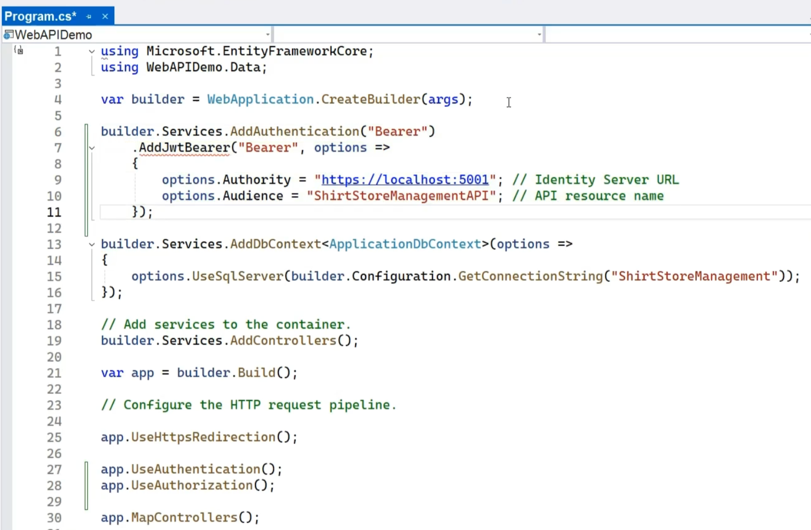

# Section 06: Securing Web Api

## Lesson 06.51: Verify JWT Token

In this section we manually implement the verification.

Otherwise the easier way is to use the nuget package [Microsoft.AspNetCore.Authentication.JwtBearer](https://www.nuget.org/packages/Microsoft.AspNetCore.Authentication.JwtBearer) and middleware:



First we add Authentication service:

```cs
builder.Services.AddAuthentication("Bearer")
 .AddJwtBearer("Bearer",
 options =>
 {
  options.Authority = "https://localhost:5001"; // Identity Server URL
  options. Audience = "ShirtStoreManagementAPI'; // API resource name
 });
```

Then we add middleware:

```cs
app.UseAuthentication();
app.UseAuthorization());
```

## Lesson 06.53: Save and reuse JWT Token

We are saving in a session cookie. We change _Program.cs_:

```cs
builder.Services.AddSession(options =>
{
    options.IdleTimeout = TimeSpan.FromMinutes(1);
    options.Cookie.HttpOnly = true;
    options.Cookie.IsEssential = true;
});

...

app.UseSession();
```

Also, we have to inject `HttpContext` in the `WebExecuter` class. So we change _Program.cs_:

```cs
builder.Services.AddHttpContextAccessor();
```

and inject in the classes where we need.
